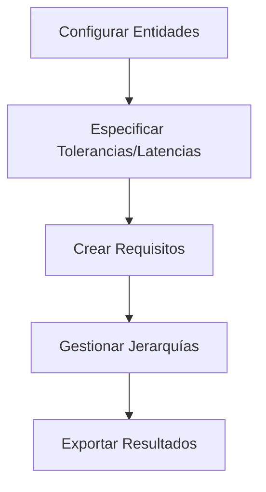

# 📋 Requisador de Requisitos

<div align="center">


**Una aplicación web profesional para la gestión de requisitos de sistemas de ingeniería**

[](https://enriquewph.com.ar/requisador)
[](https://github.com/enriquewph/requisador)
[](https://angular.dev)
[](https://www.typescriptlang.org/)

[🚀 **Ver Aplicación**](https://enriquewph.com.ar/requisador) • [📖 **Documentación**](docs/) • [🐛 **Reportar Bug**](https://github.com/enriquewph/requisador/issues)

</div>

---

## 🎯 **Descripción**

**Requisador de Requisitos** es una aplicación web moderna y profesional diseñada para ayudar a ingenieros de sistemas en la creación, organización y gestión de requisitos comportamentales y de rendimiento. Sigue estrictamente la metodología del **Systems Engineering Handbook** proporcionando un flujo de trabajo estructurado: **Configurar → Crear → Gestionar → Exportar**.

### ✨ **Características Principales**

- 🏗️ **Creación estructurada de requisitos** siguiendo estándares de ingeniería
- 🔧 **Gestión completa de entidades**: Funciones, Variables, Componentes y Modos
- 📊 **Estructura jerárquica** de requisitos con numeración automática (R0, R1-0, R1-1, etc.)
- 💾 **Persistencia automática** con localStorage (v2.0.0)
- 📱 **Interfaz responsive** optimizada para todos los dispositivos
- 🗄️ **Base de datos SQLite** local para funcionamiento offline
- 📤 **Exportación múltiple** en formatos JSON y CSV
- ⚡ **Rendimiento optimizado** con lazy loading y virtual scrolling

---

## 🚀 **Demo en Vivo**

👀 **Prueba la aplicación**: [https://enriquewph.com.ar/requisador](https://enriquewph.com.ar/requisador)

---

## 📊 **Tecnologías**

<div align="center">

| Frontend | Database | Styling | Build & Deploy |
|----------|----------|---------|----------------|
|  |  |  |  |
|  |  |  |  |

</div>

---

## 🏗️ **Arquitectura del Sistema**

### 📋 **Modelo de Dominio**

La aplicación gestiona cuatro entidades fundamentales:

1. **🔧 Funciones**: Capacidades del sistema ("Navegación", "Comunicación")
2. **📊 Variables**: Parámetros controlados ("Velocidad", "Posición")
3. **⚙️ Componentes**: Partes del sistema ("HMI", "ECI")
4. **🎯 Modos**: Condiciones operativas ("Normal", "Emergencia")

### 🗄️ **Base de Datos**

- **SQLite local** con claves foráneas y restricciones
- **Patrón Repository** para cada entidad
- **Gestión automática** de esquemas y migración de datos
- **Indexación optimizada** para consultas rápidas

### 🔄 **Flujo de Trabajo**



---

## 🛠️ **Instalación y Desarrollo**

### 📋 **Prerrequisitos**

- **Node.js** 18+ 
- **npm** 9+
- **Git**

### ⚡ **Inicio Rápido**

```bash
# Clonar el repositorio
git clone https://github.com/enriquewph/requisador.git
cd requisador

# Instalar dependencias
npm install

# Ejecutar en desarrollo
npm start

# Construir para producción
npm run build

# Servir build localmente
npm run serve
```

### 🔧 **Scripts Disponibles**

| Script | Descripción |
|--------|-------------|
| `npm start` | Servidor de desarrollo en `http://localhost:4200` |
| `npm run build` | Build de producción en `dist/` |
| `npm run watch` | Build en modo observación |

### 🎯 **Tareas de VSCode**

El proyecto incluye tareas preconfiguradas:

- **`npm start`**: Servidor de desarrollo
- **`npm build`**: Build de producción  
- **`serve dist`**: Servir con Python HTTP Server

---

## 📱 **Capturas de Pantalla**

<div align="center">

### 🏠 **Pantalla Principal**


### ⚙️ **Configuración de Entidades**


### 📝 **Creador de Requisitos**


### 📊 **Gestión de Requisitos**


</div>

---

## 🚀 **Despliegue**

### 🌐 **GitHub Pages**

El proyecto se despliega automáticamente usando GitHub Actions:

1. **Push a `main`** activa el workflow
2. **Build automático** con Angular CLI
3. **Deploy a GitHub Pages** en `https://enriquewph.com.ar/requisador`

### 🔧 **Configuración Manual**

```bash
# Build de producción
npm run build

# Los archivos están en dist/browser/
# Subir a cualquier servidor web estático
```

---

## 📖 **Documentación**

### 🗄️ **Base de Datos**

Consulta la documentación completa en [`docs/DATABASE_DOCUMENTATION.md`](docs/DATABASE_DOCUMENTATION.md)

### 🎨 **Guía de Estilo**

- **TailwindCSS** para estilos utilitarios
- **Color primario**: `#605DC8`
- **Diseño responsive** mobile-first
- **Iconografía** con Heroicons

### 🔧 **Configuración**

- **Angular 20+** con componentes standalone
- **TypeScript strict mode** habilitado
- **ESLint + Prettier** para calidad de código

---

## 🤝 **Contribuir**

### 🐛 **Reportar Bugs**

1. Verifica que no exista el issue
2. Crea un [nuevo issue](https://github.com/enriquewph/requisador/issues/new)
3. Incluye pasos para reproducir el problema

### ✨ **Proponer Features**

1. Abre un issue con la etiqueta `enhancement`
2. Describe detalladamente la funcionalidad
3. Explica el caso de uso

### 💻 **Pull Requests**

1. Fork el repositorio
2. Crea una rama: `git checkout -b feature/nueva-funcionalidad`
3. Commit: `git commit -m 'feat: añadir nueva funcionalidad'`
4. Push: `git push origin feature/nueva-funcionalidad`
5. Abre un Pull Request

---

## 📄 **Licencia**

Este proyecto está bajo la licencia **MIT**. Ver [LICENSE](LICENSE) para más detalles.

---

## 👨‍💻 **Autor**

<div align="center">

### **Enrique**

🎓 **Estudiante de Ingeniería Electrónica**  
🏫 **Universidad Tecnológica Nacional - Facultad Regional Córdoba**  
⚡ **Gladiadores Electrónicos 2025**

[](https://github.com/enriquewph)
[](mailto:quique18c@gmail.com)
[](https://enriquewph.com.ar)

</div>

---

## 🏫 **Universidad Tecnológica Nacional**

<div align="center">

**Facultad Regional Córdoba**  
**Ingeniería Electrónica**

Desarrollado como parte del proceso de aprendizaje en ingeniería de sistemas y desarrollo de software.

**Para los Gladiadores Electrónicos 2025** ⚡

</div>

---

## 🙏 **Agradecimientos**

- **Systems Engineering Handbook** por la metodología
- **Angular Team** por el framework
- **TailwindCSS** por el sistema de diseño
- **sql.js** por SQLite en el navegador
- **UTN FRC** por la formación académica

---

<div align="center">

**⭐ Si te gusta este proyecto, ¡dale una estrella! ⭐**

[](https://github.com/enriquewph/requisador/stargazers)
[](https://github.com/enriquewph/requisador/network/members)

</div>
